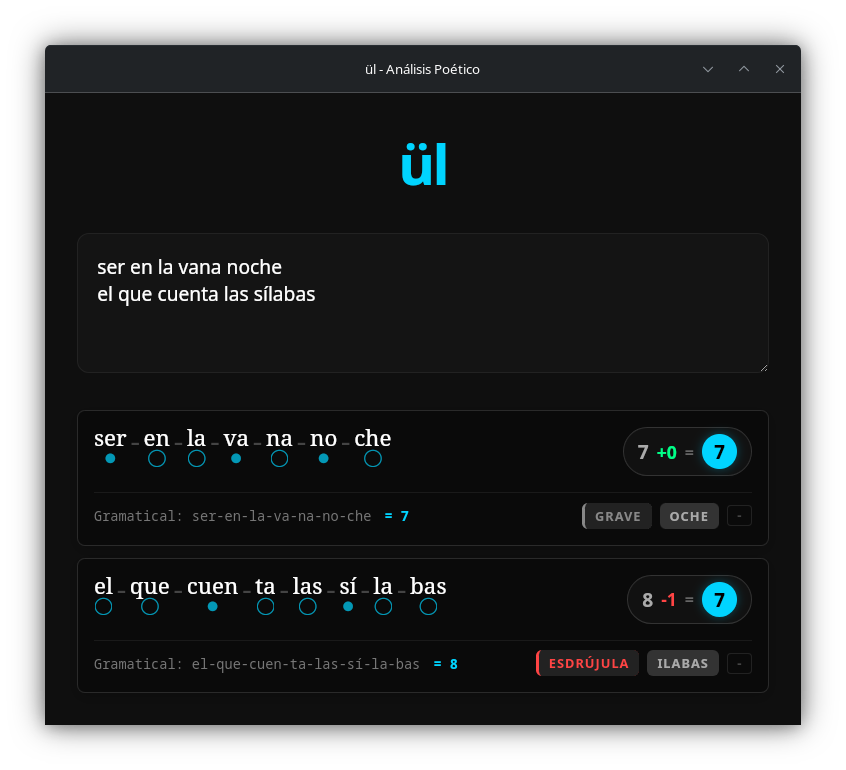

# ül

Herramienta de análisis rítmico y poético. 

Desarrollada para ofrecer un entorno de análisis textual preciso, combinando el rendimiento de sistemas de bajo nivel con una interfaz de usuario reactiva y minimalista.

## Características Principales

- Análisis rítmico automatizado de métrica poética.
- Interfaz gráfica de bajo consumo de recursos.
- Soporte multiplataforma mediante binarios nativos.
- Tubería de integración y despliegue continuo (CI/CD) automatizada.

## Instalación

Puedes descargar la última versión estable desde la sección [Releases](https://github.com/ce-r0/uls/releases) de este repositorio.

### macOS (Binario Universal para Intel y Apple Silicon)
1. Descarga el archivo `.dmg`.
2. Arrastra la aplicación a tu carpeta de Aplicaciones.
3. Nota de seguridad: Al ser software de código abierto sin firma notarial comercial, macOS bloqueará la primera ejecución. Para solucionarlo, ve a Aplicaciones, haz clic derecho sobre "ül" y selecciona "Abrir".

### Windows
1. Descarga el instalador `.msi` o `.exe`.
2. Ejecuta el instalador.
3. Nota de seguridad: Windows SmartScreen puede mostrar una advertencia de editor desconocido. Haz clic en "Más información" y selecciona "Ejecutar de todas formas".

### Linux (Fedora, Debian, Arch)
- **Usuarios de Fedora/RedHat:** Descarga e instala el paquete `.rpm` utilizando tu gestor de paquetes (`sudo dnf install ./uls-*.rpm`).
- **Formato Universal:** Descarga el archivo `.AppImage`, otórgale permisos de ejecución (`chmod +x uls-*.AppImage`) y ejecútalo directamente.

## Interfaz



## Desarrollo Local

Para contribuir o compilar el proyecto desde el código fuente, asegúrate de tener instalados Node.js (v25) y la cadena de herramientas de Rust (`rustup`).

1. Clona el repositorio:
   ```console
   git clone [https://github.com/ce-r0/uls.git](https://github.com/ce-r0/uls.git)
   cd uls
   ```
2. Instala las dependencias del entorno web:
   ```console
   npm install
   ```
3. Inicia el servidor de desarrollo de Tauri:
   ```console
   npm run tauri dev
   ```
4. Para compilar los binarios de producción:
   ```console
   npm run build
   ```
## Arquitectura y Tecnologías

* Interfaz de Usuario: Svelte
* Motor de Escritorio: Tauri
* Lenguaje Core: Rust / JavaScript
* Infraestructura CI/CD: GitHub Actions (Compilación cruzada automatizada)

## Licencia
Este proyecto se distribuye bajo la Licencia MIT. Consulta el archivo LICENSE para más detalles.

---
Desarrollado por cri-z.